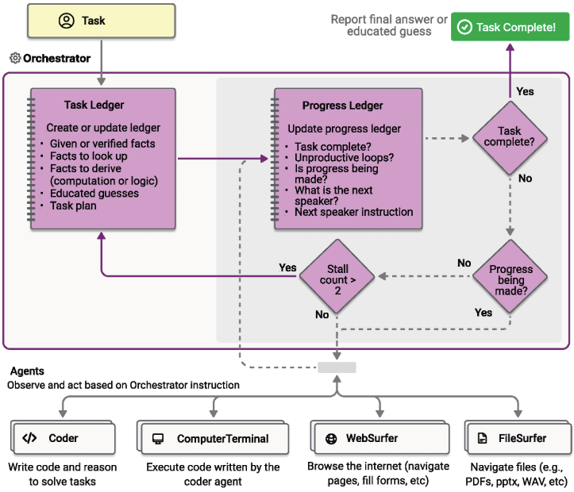

# 1、项目介绍
## 1.1、本次分享介绍       
**(第一期)[2025.1.12]AutoGen v0.4稳定版本框架介绍及AgentChat应用接口功能测试**                                                                         
**(第二期)[2025.1.13]AutoGen v0.4稳定版本Studio低代码平台使用**                              
                                       
**(第三期)[2025.1.15]AutoGen v0.4稳定版本Magentic-One CLI功能测试**                            
                          
**(第四期)[2025.1.21]AutoGen v0.4稳定版本AutoGen-Extensions 外部服务或功能库集成功能测试**                             
主要内容：与LangChain提供的Tools进行功能集成测试                 
               
**(第五期)[2025.1.23]AutoGen v0.4稳定版本发布后第一次重大更新发布v0.4.3,Extensions官方扩展库新增功能测试**                                          
主要内容：为大家介绍两个重大更新:使用缓存系统提高大模型的响应效率、集成调用GraphRAG                       
                    
**(第六期)[2025.2.9]AutoGen v0.4.5版本新增功能测试**                                                                                    
主要内容：AgentChat中为Agent和Team提供流式模型输出服务，支持DeepSeek R1式推理输出           
                   
**(第七期)[2025.2.13]AutoGen v0.4.6版本新增功能测试**                                                                                    
主要内容：AutoGen与DeepSeek R1模型集成(Ollama方式本地部署deepseek-r1:14b大模型)、AutoGen与MCP服务器集成、AutoGen与HTTP API工具集成         
        

## 1.2 AutoGen介绍
AutoGen是微软发布的一个用于构建AI Agent系统和应用程序的开源框架                                                              
github地址:https://github.com/microsoft/autogen                                                         
文档地址:https://microsoft.github.io/autogen/stable/index.html                                         
最新架构AutoGen v0.4正式发布第一个稳定版本                                              
v0.4版本是对AutoGen的一次从头开始的重写，目的是为构建Agent创建一个更健壮、可扩展、更易用的跨语言库                                           
AutoGen v0.4的应用接口采用分层架构设计，存在多套软件接口用以满足不同的场景需求                                                             
**(1)Magentic-One CLI**                        
基于控制台的多Agent助手，用于执行基于 Web 和文件的任务。 基于 AgentChat 构建                
**(2)Studio**                         
一款无需编写代码即可进行原型设计和管理Agent的应用程序。基于 AgentChat 构建                  
**(3)Core:事件驱动型接口，核心接口，autogen-core**         
用于构建可扩展的多Agent人工智能系统的事件驱动编程框架                      
**(4)AgentChat:任务驱动型应用接口，autogen-agentchat**              
用于构建会话式单Agent和多Agent应用程序的编程框架，建立在Core核心层之上，抽象了许多底层系统概念                      
**(5)Extensions:第三方系统接口，扩展包，autogen-ext**                    
与外部服务或其他库交互的 Core 和 AgentChat 组件的实现。可以查找并使用社区扩展或创建自己的社区扩展                                   
如OpenAI模型客户端接口等，除内置扩展外，该扩展包还容纳社区贡献的扩展接口                         

## 1.3 AgentChat:任务驱动型应用核心概念      
### 1.3.1 Models 大模型
Agent需要访问LLM模型服务                                       
由于有许多不同的提供者具有不同的API,autogen-core为模型客户端实现了一个协议                         
而autogen-ext为流行的模型服务实现了一组模型客户端,如OpenAI、本地模型                                               

### 1.3.2 Messages  消息通信
在AgentChat中，消息促进与其他Agent、orchestrators和applications的通信和信息交换                        
AgentChat支持各种消息类型，每种消息类型均针对特定目的而设计               
**(1)Agent-Agent Messages**                          
此消息类型允许文本和多模式通信，并包含其他消息类型，例如TextMessage或MultiModalMessage                             
**(2)Internal Events**                           
这些消息用于传达Agent本身内的事件和操作信息                                     

### 1.3.3 Agents 智能体
**AgentChat提供了一组预设Agents，每个Agent在响应消息的方式上都有所不同:**                                            
AssistantAgent:是一个内置的Agent，使用大语言模型，并且具有使用工具的能力                       
UserProxyAgent:接受用户输入的Agent将其作为响应返回                               
CodeExecutorAgent:可以执行代码的Agent                      
OpenAIAssistantAgent:由 OpenAI Assistant 支持的Agent，能够使用自定义工具                           
MultimodalWebSurfer:一种多模式Agent，可以搜索网络并访问网页以获取信息                    
FileSurfer:可以搜索和浏览本地文件以获取信息的Agent                      
VideoSurfer:可以观看视频以获取信息的Agent                              
**(1)所有Agent共享以下属性和方法**                                                       
**name**                   
指定Agent的唯一名称                        
**description**            
Agent的描述信息            
**model_client**                  
指定Agent使用的大语言模型              
**on_messages()**                  
向Agent发送一系列ChatMessage并获取Response               
**on_messages_stream()**                    
与on_messages()相同，但返回AgentEvent或ChatMessage的迭代器，后跟Response作为最后一项                              
**on_reset()**                    
将Agent重置为其初始状态                       
**run()和run_stream()**             
分别调用on_messages()和on_messages_stream()的便捷方法，但提供与Teams相同的接口                           
**(2)AssistantAgent是一个内置的Agent,其相关额外属性**                   
**tools**                      
提供给Agent使用的工具集合                    
**system_message**                         
Agent的系统提示词               
**model_context**                               
使用模型上下文                   

### 1.3.4 Teams 团队
在AgentChat中Team由一个或多个Agent组成，定义了Agent组如何协作完成任务                      
Team通过接收任务和返回任务结果与应用程序交互                   
Team是有状态的，并在多个任务中保持上下文，需要终止条件来决定何时停止处理当前任务                       
**AgentChat提供了一组预设Teams:**     
**BaseGroupChat**                    
Team的基类，其他4中Team预设类别均继承该基类                                      
**RoundRobinGroupChat**                   
该预设Team中的参与者(Agent)以顺序循环的方式轮流向所有参与者发布信息                   
该预设Team允许所有的Agent共享上下文，并以循环方式轮流做出响应            
其属性如下:         
participants:设置Team的参与者(Agent) ,List列表                           
termination_condition:Team终止条件，默认None则无限期运行              
max_turns:Team支持的最大会话回合数，默认None则无限制            
**SelectorGroupChat**                   
该预设Team中的参与者(Agent)以推荐选择的方式轮流向所有参与者发布信息                    
每次消息发布后，都会使用ChatCompletionClient(LLM)选择下一个发言者(Agent)                      
其属性如下:            
participants:设置Team的参与者(Agent) ,List列表                 
model_client:设置LLM，ChatCompletionClient             
termination_condition:Team终止条件，默认None则无限期运行                  
max_turns:Team支持的最大会话回合数，默认None则无限制                 
selector_prompt:用于选择下一个发言者(Agent)的prompt模版                   
allow_repeated_speaker:是否允许连续选择同一个发言者(Agent)，默认False则不允许                     
selector_func:自定义选择器函数，用于获取对话历史记录并返回下一个发言者(Agent),若启动该功能则LLM选择会失效，若该函数返回None,则LLM会主动接管进行下一位发言者(Agent)的选择                   
**Swarm**                   
该预设Team中的参与者(Agent)以移交方式向所有参与者发布信息                   
参与者列表中的第一个参与者是初始发言者，下一位发言者是根据HandoffsMessage消息中指定的参与者。若无移交信息，则当前发言者继续发言              
其属性如下:         
participants:设置Team的参与者(Agent) ,List列表                           
termination_condition:Team终止条件，默认None则无限期运行              
max_turns:Team支持的最大会话回合数，默认None则无限制    
**MagenticOneGroupChat**                            
一个通用的多Agent系统，用于解决各种领域的开放式网络和基于文件的任务              
它代表了多代理系统向前迈出的重要一步，在多项代理基准测试中取得了极具竞争力的性能            
其属性如下:         
participants:设置Team的参与者(Agent) ,List列表                           
termination_condition:Team终止条件，默认None则无限期运行              
max_turns:Team支持的最大会话回合数，默认None则无限制    
**(1)Team管理**                 
**run()**               
处理任务并返回任务结果             
**run_stream()**               
类似于run()，处理任务并返回异步生成器消息内容和最终任务结果             
**reset()**               
将清除Team的状态，包括所有Agent。它将调用每个Agent的on_reset()方法来清除Agent的状态                           
**set()**                 
将停止Team。将在当前Agent的轮次结束时停止Team。因此，Team可能不会立即停止。这允许当前Agent完成其轮次，并在Team停止之前向Team广播最终消息，从而保持Team状态一致            
**中止Team 传递给cancellation_token参数**
可以中止对run()或run_stream()的调用 在执行期间，通过设置传递给cancellation_token参数的CancellationToken                          

### 1.3.5 Human-in-the-Loop 人类反馈
通过应用程序与Team交互的主要方式有两种:
**(1)在运行期间提供反馈:**                    
在Team运行期间,通过UserProxyAgent提供反馈          
UserProxyAgent是一个特殊的内置Agent，充当用户向Team提供反馈的Agent                                 
当UserProxyAgent在运行期间被调用时，它会阻止Team的执行，直到用户提供反馈或出错为止。这会使Team处于无法挽救或恢复的不稳定状态                       
由于此方法的阻止性质，建议仅将其用于需要用户立即反馈的简短交互，例如通过单击按钮请求批准或不批准                            
**(2)为下一次运行提供反馈**                              
Team运行终止后，应用程序或用户提供反馈，Team带着反馈再次运行                                    
这种方法在Team和应用程序/用户之间进行异步通信的持久会话中非常有用:一旦Team完成运行，应用程序就会保存Team的状态，将其放入持久存储中，并在反馈时恢复Team           
提供两种方式:                    
设置最大回合数，以便Team始终在指定回合数后停止                                                                    
使用TextMentionTermination和HandoffTermination等终止条件，让Team根据Team的内部状态决定何时停止并交回控制权                                                    

### 1.3.6 Termination 终止条件
Team运行后可以一直运行下去，在很多情况下需要知道何时停止运行，这就是终止条件的作用                 
终止条件是有状态的，但在每次运行run()或run_stream()结束后会自动重置              
多个终止条件支持使用AND或OR运算符进行组合                
目前支持如下8种终止条件:           
**MaxMessageTermination**
在生成指定数量的消息，包括Agent和Task消息后则终止                        
**TextMentionTermination**           
当在消息中提到特定的文本或字符串则终止                    
**TokenUsageTermination**             
当使用了一定数量的tokens时则终止                
**TimeoutTermination**           
在指定的持续时间(以秒为单位)后终止             
**HandoffTermination**          
在请求移交至特定目标后终止。特别适合需要用户干预的场景               
**SourceMatchTermination**                         
在特定的Agent做出响应之后终止                            
**ExternalTermination**                                 
允许从运行外部对终止进行控制。特被适合用户界面集成(如聊天中的停止按钮)场景                                        
**StopMessageTermination**                                  
当Agent发出StopMessage时终止                                

# 项目初始化

##  安装项目依赖          
命令行终端中执行如下命令安装依赖包                         
pip install -U "autogen-agentchat"                                                
pip install "autogen-ext[openai]"                           
pip install asyncio==3.4.3                       

# 测试
##  AgentChat框架基本功能测试
相关测试代码在BasicTest文件夹下                    

##  Magentic-One CLI使用   
**核心设计思想:**                                            
                 
**其过程如下:**                  
Magentic-One的工作基于一个多Agent架构，其中的首席协调者(Orchestrator)Agent负责高层次规划、指导其他Agent并跟踪任务进度                                 
协调者首先要制定一个处理任务的计划，在任务分类账中收集所需的事实和有根据的猜测                               
在计划的每一个步骤中，协调者都会创建一个进度账本，对任务进度进行自我反思，并检查任务是否已完成                                  
如果任务尚未完成，它会为 Magentic-One 的其他Agent分配一个子任务来完成。被分配的Agent完成子任务后，协调者会更新进度分类账，并以这种方式继续直至任务完成                                                           
如果协调者发现进度不够，可以更新任务分类账并创建新计划。如上图所示，协调者的工作分为更新任务分类账的外循环和更新进度分类账的内循环                   
**在命令行终端中使用:**                       
首先安装依赖 pip install -U magentic-one-cli                                     
直接运行 m1 "我今天的心情非常不错" 进行问答                                         
export OPENAI_BASE_URL="https://yunwu.ai/v1"                                
export OPENAI_API_KEY="sk-COUbOl2EH7IYaz6SqFADUp7Ie4WA4rzFvNr3PzIAZjVyHQcJ"                                        
**在代码中集成使用:**                                                
相关测试代码在MagenticOneCli文件夹下的1_BasicTest.py                                     

##  AutoGen-Extensions 使用                     
相关测试代码在Extensions文件夹下                
首先打开命令行终端，运行命令安装依赖 pip install autogen-ext                       
**(1)使用LangChain提供的Tools**                                              
**测试用例1:** PythonAstREPLTool                                  
当前测试脚本在Extensions/LangChainTest文件夹下                                           
下载测试数据集:https://github.com/pandas-dev/pandas/blob/main/doc/data/titanic.csv                                            
打开命令行终端，运行命令安装依赖 pip install langchain_experimental                                     
运行脚本 python PythonAstREPLTool.py                               
**测试用例2:** 测试duckduckgo搜索                         
Tools介绍:https://python.langchain.com/docs/integrations/tools/                                                             
duckduckgo文档:https://duckduckgo.com/duckduckgo-help-pages/settings/params/                                                                                
打开命令行终端，运行命令安装依赖 pip install -qU duckduckgo-search langchain-community                                               
运行脚本 python DuckDuckGoSearch.py                                        

##  AutoGen V0.4.3重大更新     
首先，一次运行如下命令，升级相关的依赖包到最新版本V0.4.3(2025-01-23)                                            
pip install --upgrade autogen-core                                                    
pip install --upgrade autogen-agentchat                                                       
pip install --upgrade autogen-ext                         
**(1)使用缓存系统提高大模型的响应效率**             
使用缓存系统(DiskCacheStore和ChatCompletionCache)来避免重复的API请求，提高大模型的响应效率                 
第一次请求会从大模型获取响应并将其缓存                                 
第二次请求相同消息时，将直接返回缓存的响应，而不再调用大模型的API接口                                         
使用缓存的目的是提高性能，减少重复请求，提高响应速度，尤其在对相同输入频繁请求时非常有效                                 
相关测试代码在Extensions/Cache目录下，运行相关的代码进行测试前，需安装相关依赖 pip install diskcache                                       
在运行 python CacheTeam.py 脚本之前，在当前目录下创建空文件夹tmpdirname                  
**(2)集成调用GraphRAG**             
GraphRAG相关视频:                           
https://www.bilibili.com/video/BV1AADaYfE2T/                                    
https://youtu.be/7WFMd8U8C7E                                         
**(a)构建GraphRAG索引**                  
首先构建GraphRAG，安装相关依赖，最新版本1.2.0版本                                   
pip install graphrag==1.2.0                   
创建项目并初始化                          
cd Extensions/GraphRAG                
mkdir -p ./ragtest/input                                  
cd ragtest                         
graphrag init --root ./                           
修改.env和settings.yaml文件内容，请参考提供的文件内容进行调整                                                
接下来，优化提示词(可以不优化)                   
python -m graphrag prompt-tune --config ./settings.yaml --root ./ --language Chinese --output ./prompts                      
最后运行如下命令，进行索引构建                                             
graphrag index --root ./                            
索引构建完成后，进行检索测试                           
graphrag query --root ./ --method local --query "张三九的基本信息?"                 
graphrag query --root ./ --method global --query "给张三九一些健康建议?"                       
**(b)AutoGen集成调用**           
运行 python GraphRAGTeam.py 进行测试                   

##  AutoGen V0.4.5功能更新     
首先，一次运行如下命令，升级相关的依赖包到最新版本V0.4.5                                                       
pip install --upgrade autogen-core                                                     
pip install --upgrade autogen-agentchat                                                        
pip install --upgrade autogen-ext                          
**(1)为AgentChat的Agent和Team提供流式模型输出服务**                      
如果想在控制台应用程序中查看令牌流，可以直接使用Console                
如果自己处理消息并将其流到前端，引入ModelClientStreamingChunkEvent，用于Agent中的流式模型输出和更新处理，只需要在定义Agent的时候，启用该参数model_client_stream=True                                   
相关测试代码在BasicTest目录下，运行 python 5_RunTeamStream.py 进行测试                                       
**(2)支持DeepSeek R1式推理输出**                       
这里为大家使用代理的方式测试DeepSeek-R1模型                       
相关测试代码在BasicTest目录下，运行 python 6_RunTeamDeepSeek.py 进行测试                  
         
##  AutoGen V0.4.6功能更新     
首先，一次运行如下命令，升级相关的依赖包到最新版本V0.4.6                                                        
pip install --upgrade autogen-core                                                      
pip install --upgrade autogen-agentchat                                                         
pip install --upgrade autogen-ext                            
**(1)AutoGen与DeepSeek R1模型集成**                          
使用Ollama方式本地部署deepseek-r1:14b大模型                              
相关测试代码在BasicTest目录下，运行 python 7_RunTeamDeepSeekOllama.py 进行测试            
**(2)AutoGen与MCP服务器集成**           
首先运行如下指令安装相关的依赖                  
pip install mcp-server-fetch              
pip install json-schema-to-pydantic          
mcp-server-fetch:从互联网获取 URL 并将其内容提取为markdown,参数:url(链接地址);参数:max_length(返回的最大字符数,默认值:5000);raw(获取原始内容而不进行Markdown转换,默认:false)                   
关于MCP协议相关视频，参考如下项目                      
https://github.com/NanGePlus/MCPTest                          
相关测试代码在BasicTest目录下utils/mcp_server_fetch.py和8_RunTeamStreamMCP.py，运行 python 8_RunTeamStreamMCP.py 进行测试            
**(3)AutoGen与HTTP API工具集成**           
支持远程调用HTTP API工具             
相关测试代码在BasicTest目录下，运行 python 9_RunTeamStreamHttpTool.py 进行测试      

